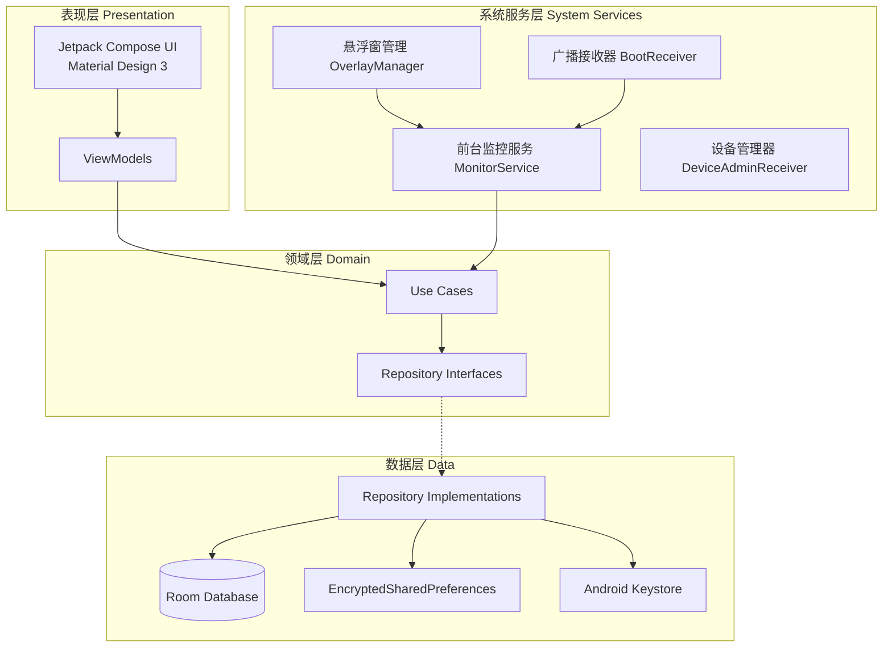
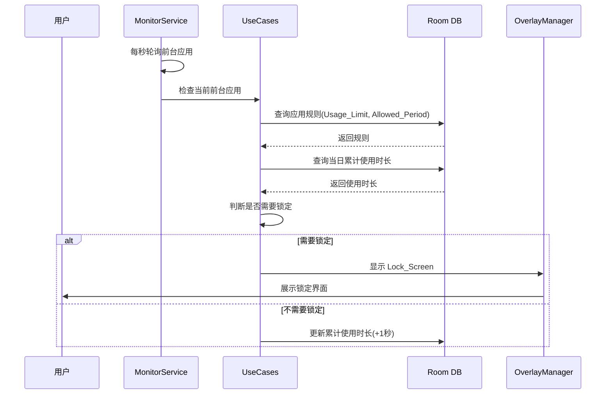

# 技术设计文档：App使用控制器

## 概述（Overview）

App使用控制器是一款安卓原生应用，旨在帮助用户管理和限制手机应用的使用时长与使用时间段。系统通过前台服务持续监控目标应用的使用状态，在超出限制时以悬浮窗形式锁定应用，并提供使用统计、密码保护、生物识别验证和强制锁定等功能。

### 技术栈

- 语言：Kotlin
- 最低 SDK：API 26 (Android 8.0)
- 目标 SDK：API 34 (Android 14)
- 架构模式：MVVM + Clean Architecture
- 依赖注入：Hilt
- 本地数据库：Room
- UI 框架：Jetpack Compose + Material Design 3
- 异步处理：Kotlin Coroutines + Flow
- 图表库：Vico (Compose 原生图表库)
- 生物识别：AndroidX Biometric (BiometricPrompt)
- 加密存储：Android Keystore + EncryptedSharedPreferences
- 属性测试：Kotest Property Testing

## 架构（Architecture）

系统采用分层架构，分为表现层、领域层和数据层，通过依赖注入实现松耦合。

### 核心监控流程

